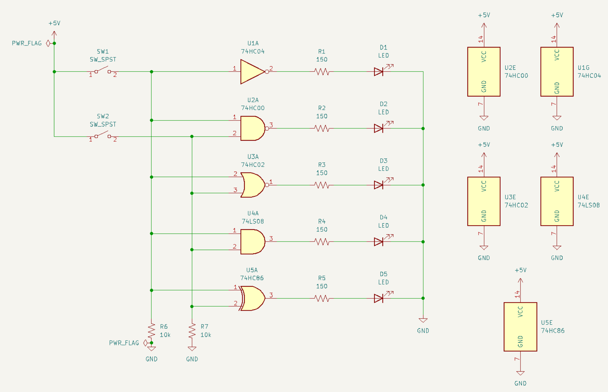
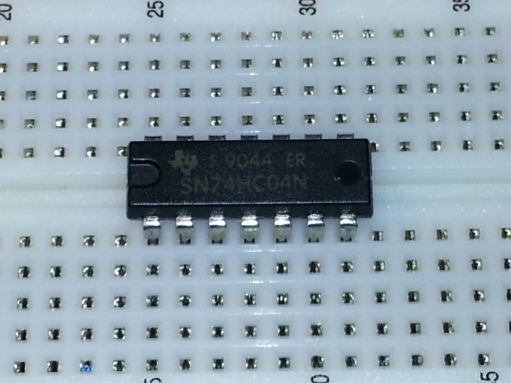

# Lab 1

# Designing and Implementing Digital Circuits

---

## Table of Contents

| Step | Description                              | Points |
|------|------------------------------------------|--------|
| 0    | Lab Assignment (.ipynb file)             | 36     |
| 1    | Schematic-based Circuit Design           | 20     |
| 2    | Power and Ground Jumper Installation     | - |
| 3    | Push Button and Pull-Down Resistor Wiring| - |
| 4    | Inverter and LED Test                    | - |
| 5    | Wire and Verify NAND, NOR, AND, and XOR Gates |44     |
| 6    | Confirm checkoffs and clean up           | 0\*      |
| -    | Submission Instructions                  | -      | 

Total: 100

\* **You will receive a lab penalty if you got checked off after your lab section, or if your lab station is not clean at the end of lab, or if you have violated the lab liquids policy.** 
These rules exist for a reason, please do not make us have to enforce them.

## Instructional Objectives

* To learn how to build a digital circuit with logic gates such as NOT, NAND, NOR, AND and XOR.
* To use the KiCAD schematic editor to plan out a digital circuit in a schematic.
* To implement the design on a breadboard aided by the schematic.

## Step 0. Lab preparation and Free Response Questions

You should be familiar with the contents of lectures from week 1 before attempting this lab. Then:

* Read this entire lab document.
* Watch the videos describing how a solderless breadboard works on the References page.
* Identify the 74HC chips mentioned in the `submission/lab1.ipynb` assignment included in this repository.  
* Set up your computer with the requisite software needed to use your AD2 unit, as described below.

### **Note: Students are required to submit the .ipynb file and .json on Gradescope!!! Refer to the `Submission Instructions` section** 

## Out-of-lab Software Setup

We highly recommend that you attempt software setup as early as possible, so that any issues you encounter may be resolved quickly and explained to other students with the same issue. This sets up your own computer with the necessary software to use your AD2 without having to come to lab (although you should still show up to get checked off).

**Skip this step if you are already on a lab machine - the shortcut for KiCAD EESchema, WaveForms and AutoLab should already have been added by the setup script you ran in lab 0.** If you did not run it for some reason, do it now: press the Start key, type "terminal", press Enter, and in the window that appears, run "~ece270/bin/setup".

By now, you should have the AD2 system. This will serve as your lab equipment away from lab - it provides an onboard oscilloscope, power supply, waveform generator, DMM and static IO analyzer. If you do not have one, you must email your primary contact TA and ask what to do.

To be able to use your device, you will need to download the requisite software:

1. Download and install the Waveforms software from Digilent [here](https://digilent.com/shop/software/digilent-waveforms/download). If you're on a Linux system, you'll additionally need the Adept Runtime which you can download [here](https://digilent.com/shop/software/digilent-adept/download).
2. Reboot your system after installing and launch the software with your respective device connected via USB. Ensure that the software can recognize it.
3. For all physical labs including this one, you will use the AutoLab application to automate AD2 verification. The application will connect to your AD2, ensure that your circuit is wired up correctly by running a series of tests, and produce a "completion code" for you to submit in your zip file as explained below. You can download AutoLab here for your specific operating system.
4. Perform a quick test to ensure AutoLab can find and use your AD2 by opening the AutoLab application after downloading and extracting it. Connect your AD2, and press the "Detect your AD2" button. If the indicator above the button turns green and the button's text changes to show your AD2's serial number, the application is working correctly, and you can close it for now. If you face issues, contact course staff immediately.

Next, install the KiCAD suite of software, which will include EEschema, a schematic editor. You will use EEschema to plan out your digital circuit. You can download KiCAD from [here](https://kicad.org/download/) - use the GitHub mirror.

## Step 1: Schematic-based Circuit Design

At this point, you should be familiar with the operation of logic gates from the lab assignment and from the lecture content. We'll work with only five of them for now. To remind you:

* A NOT gate outputs a 1 if its single input is 0, and vice versa.

| A | Y |
|---|---|
| 0 | 1 |
| 1 | 0 |

* An AND gate outputs a 1 if and only if all of its inputs are 1.

| A | B | Y |
|---|---|---|
| 0 | 0 | 0 |
| 0 | 1 | 0 |
| 1 | 0 | 0 |
| 1 | 1 | 1 |

* A NAND gate outputs a 0 if and only if all of its inputs are 1. (This is effectively an AND gate followed by a NOT gate.)

| A | B | Y |
|---|---|---|
| 0 | 0 | 1 |
| 0 | 1 | 1 |
| 1 | 0 | 1 |
| 1 | 1 | 0 |

* A NOR gate outputs a 0 if any of its inputs are 1. (This is effectively an OR gate followed by a NOT gate.)

| A | B | Y |
|---|---|---|
| 0 | 0 | 1 |
| 0 | 1 | 0 |
| 1 | 0 | 0 |
| 1 | 1 | 0 |

* An XOR gate outputs a 1 if and only if exactly one of its inputs is 1.

| A | B | Y |
|---|---|---|
| 0 | 0 | 0 |
| 0 | 1 | 1 |
| 1 | 0 | 1 |
| 1 | 1 | 0 |

We'll start designing our circuit by first creating a functional representation of our circuit in a format called a **schematic**. Once you've installed EEschema as per the Software Setup section above, launch it, and the option to use the "default symbol table" if it appears.

You'll now draw the schematic shown below:

Figure 1: Schematic for the circuit to be implemented in this lab.

How to draw your schematic:

* Pressing A anywhere on the schematic will give you a list of components that you can add to the circuit view. You can also get the same menu by clicking the "Draw" option on the top menu. When adding a gate, you'll want to add two units - one that models the gate itself, with input and output pins, and the last unit that has power and ground pins, which will be used to provide a supply for the gate. Note the difference in shapes between these units in the schematic above in order to identify them in the menu.
* To draw wires, press W anywhere on the schematic to change to wire mode. Click once to set a point, move your mouse to the second point, and click again to set it and affix the wire. If your mouse keeps drawing wires when you move it, hit the Escape button a couple of times to return to normal cursor mode.
* The AND gate in your kit is a 74HC08, which does not appear in Eeschema's symbol table. Use the 74LS08 instead.
* Ensure that all components are labeled with their respective names and/or values by pressing E with your mouse over the value to change it.
* To duplicate a component, hover over the component with your cursor and press C/right-click and press Duplicate.
* You may need to rotate some components, such as resistors. When you are adding a component attached to your cursor, or if your cursor is hovering over an existing component, press R to rotate it.
* Some components may have additional labels not shown in the example above. To clear those, edit the component value to contain only a space so that it appears blank.
* Be careful while making connections - if you see a green dot where two wires intersect, it means they're connected. Ensure that you're making any connections that aren't indicated in the example schematic by comparing the large green dots.
* To drag components around, put your cursor over the component, press G, move your mouse, and click to release.
* To remove a component, put your cursor over the component, press the Delete key, or right click to delete.
* Connections are easier to make when all wires are perfectly horizontal and vertical. You will lose points if your schematic is not neatly drawn.

Note that the numbers on the gates are the pin numbers on the chips - **this is important**. You should recall which numbers correspond to which pins from the lab assignment for each chip. You can therefore use the schematic to tell you which pins you should connect wires and/or resistor + LEDs to once you get to the wiring.

Finally, you'll need to run an Electrical Rule Checker (ERC) to ensure that your schematic is correct. Before that, we'll disable a warning and an error that will unnecessarily trigger due to the simplicity of the schematics you'll draw in this class. To do this, click File > Schematic Setup, and click the Violation Severity window. Scroll down to the Miscellaneous section and:

* Change the "Symbol has units that are not placed" violation severity to Ignore.
* Change the "Symbol has input pins that are not placed" violation severity to Ignore.g

> Disabling these warnings only applies to this class. If you continue to use KiCAD EEschema in higher level classes, or maybe even professionally, you should not keep these warnings disabled. They are there to help you catch mistakes with much more complex designs.

These violations are not relevant to our circuit as we will have some pins on the chip that are not connected to anything. Notice that there is another violation, "Symbol has power input pins that are not placed", which we'll leave since we want you to remember to connect power/ground to your chips. Click OK to save your changes, and then click Inspect > Electrical Rule Checker > Run ERC.

> Make sure the ERC check does not yield any errors. Then, zoom in so that your schematic is as big as possible on your screen, and **show it and your ERC check to your TA to receive points for Step 1**. Then, save the schematic file somewhere on your computer (ask your TA if you need assistance) and submit it in the zip file as indicated in the `Submission Instructions` section.

## In-lab software setup

If you are doing this lab in the physical lab (EE 65), you'll need to have run the setup script as directed by TAs in lab 0. If you have not already run the setup script and generated the shortcuts for Waveforms and other applications, please do so by running "~ece270/bin/setup".

Once logged in, plug your AD2 in via USB to the machine you are working on, and open Waveforms with the desktop shortcut. It should open, detect your AD2, and show you a screen that looks like this:

Figure 2: New WaveForms window after detecting AD2.

The AD2 will serve as your lab equipment away from lab - it provides an onboard oscilloscope, power supply, waveform generator, DMM and static IO analyzer, all accessible through the WaveForms software.

## Step 2: Power and Ground Jumper Installation

Connect power and ground jumpers on your breadboard(s), as shown in Figure 1. Connect each of the power strips that run between the breadboard sections so that the "red rail" strips are all connected to each other, and the "blue rail" strips are all connected to each other. We will use the adjustable power supply on the Digilent Analog Discovery 2 (AD2) system to power most experiments, typically configuring it for 3.3V.

If it is not already installed, attach the [2x15-wire "flywire" assembly](src/lab1_flywire.png) (picture shown here, reproduced from digilent.com) to the AD2. Insert the V+ (red) lead into the red rail of the breadboard system using another wire or the [double-ended 1x6 pin assembly](src/lab1_pinheader.png) that comes with the AD2. Insert any of the ground (🠋) (black) leads into the blue rail of the breadboard system in the same way.

See the image below:

Figure 3: Breadboard with power and ground jumpers installed.

If you have a master lab kit from a previous semester, your lab kit contains several red LEDs that have built-in resistors. If you look closely at the red LEDs, you can see a small black dot inside. That's the resistor. The vast majority of red LEDs do NOT have a resistor, and the use of such strange devices gives students the false impression that red LEDs can be used safely in circumstances where the voltage would destroy normal LEDs. Therefore, we will not be using red LEDs with resistors. We will use normal LEDs (of various colors) that do not have internal series resistors. You should be careful to always use a series resistor, although when using a 3.3V power supply, omitting it may not result in problems.

For this experiment, take one of the green LEDs from your parts kit and connect it in series with a resistor in such a way that current will flow through it when you enable the power supply:

* Each LED has two leads. One is longer than the other.
   * The long lead is the anode. Plug that in to the positive (red) rail of the breadboard.
   * Plug the shorter lead (the cathode) in to the middle of the breadboard.

* Find a 150Ω (any value near this, such as 200Ω, is also fine) from your parts kit and connect it between the cathode of the LED and the negative (blue) rail of the breadboard. Be sure to use the DMM at your station to double check the resistor size.

Once the resistor has been attached in series with the LED, turn on Supplies from your AD2 as follows:

* Open Waveforms with your AD2 connected. Ensure that you are using your AD2 and not the demo one by checking that the connected device has a serial number that looks like this, and does not have the word DEMO in it.

Figure 4: Serial number of an example AD2.

* On the sidebar, select the "Supplies" tool. There are two buttons on the left side of the Supply Tool window that enable the positive and negative supplies. Turn off the Negative Supply (V-). Make sure that the "Positive Supply (V+)" is still On. Set the slider for the Positive Supply (or type in the box) for 3.3V. At the top of the window is the "Master Enable" button. Click it to turn on the supply.

Once you have enabled the power supply from your respective device, the LED should illuminate as shown in Figure 5.

Figure 5: Connection of power indicator LED.

If, for some reason, you omit the resistor, the LED will be extremely bright and get warm. The AD2 power supply may notice excessive current flow and automatically turn off. Even if you did wire the LED and resistor correctly, you might want to test the current limiting feature of the power supply. Enable the power supply and connect a wire between the red and blue rails of the breadboard power strips.

> Demonstrate this procedure to your TA to recieve points for Step 2.

## Step 3: Push Button and Pull-down Resistor Wiring

Insert the two 12mm push buttons into your board, along with the 10KΩ pull-down resistors, as as shown in Figure 5. Connect the upper left pin of each button to the +3.3 VDC power supply (red) rail. Place a 10KΩ – or larger – resistor between the upper right pin of button and the ground (blue) rail.

When using the push buttons, you should know that the upper left and lower left pins are always connected internally. The upper right and lower right pins are always connected internally. When the push button is pressed, the pins on the left are connected to the pins on the right. The large resistor is called a “pull-down” resistor, since it weakly pulls the voltage low. When the button is not pressed, the upper right pin is connected through the resistor to ground. When the button is pressed, the left side is connected to the right side, and strongly pulled to 3.3V. When the button is pressed, there is a small amount of current is wasted through the resistor. The higher the resistor value, the less current is wasted. This is why we want to use a large resistor.

Figure 6: Connection of power indicator LED.

In Waveforms, select the "Voltmeter" tool to measure the voltage output. You will notice that there are two channels: channel 1(1+) and channel 2(2+). You can choose either channel to measure the voltage on the resistor connected to the button. Ensure that the channel's negative pin (1- or 2- depending on the channel you choose) is connected to the ground(blue) rail of the breadboard.

> Test each button with the voltmeter on your AD2 to make sure that the voltage on the resistor connected to the button normally measures “0.0 volts” with respect to ground, and measures (approximately) “3.3 volts” when the button is pressed. **Demonstrate this to your TA to receive points for Step 3.**

## Step 4: Inverter and LED Test

You are now ready to demonstrate the functionality of some common logic functions. Locate a 74HC04 (hex inverter) integrated circuit in your DK-2 parts kit.

Normally, such integrated circuits have leads that angle outward from the black package, so they do not naturally fit into the holes like the one on the left side of Figure 6. The first time you use one, you should gently bend the leads on each side by pressing it against a flat surface – such as a table. Visually observe the pins to see if they are straight and that the rows are 0.3 inches apart (like the one on the right in Figure 6). Find the notch on the package that indicates the orientation (as shown in Figure 7). Insert the 74HC04 into the breadboard with the notch on the left side. When the notch is on the left side, pin 1 is the lower left, pin 7 is on the lower right, and pin 14 is on the upper left.

Figure 7: Pin angles

Figure 8: Position of notch on left side of chip

Connect the 74HC04 to power (pin 14) and ground (pin 7). Connect one of the inputs (pin 1) to one of the push button, and connect the corresponding output (pin 2) through a series resistor (about 150Ω again) to the anode of a green LED (connect the cathode of the LED to ground). Verify that the inverter works as anticipated. An illustration of what your board should look like at this point is shown in Figure 8. Notice that the LED on the output of the inverter should be illuminated as long as the button is not pushed.

Figure 9: Pushbutton, inverter and LED

> To your TA, demonstrate that when an LED connected to the input gate (pin 1) of the inverter is on, an LED connected to the corresponding output gate (pin 2) of the inverter will be off, and vice-versa.
> **Proving the functionality of your inverter will allow you to receive points for Step 4.**

## Step 5: Wire and Verify NAND, NOR, AND, and XOR Gates
FV
At this point, you may disconnect the inverter if you wish - it will not be tested since its functionality is very simple. Repeat Step (3), using a 74HC00 (quad 2-input NAND), 74HC02 (quad 2-input NOR), 74HC08 (quad 2-input AND), and 74HC86 (quad 2-input XOR). Read the [datasheets](../../refs/) on the ECE 270 web site's reference page carefully to find out the function of each of the pins of each integrated circuit.

Then, **carefully** go over the schematic diagram below. Understand the connections made between the pins of the IC chips, pushbuttons and LEDs, and how they are implemented on the circuit in the diagram below.

You will need to connect both push buttons to make this work (you can simply attach another wire to the output of the pushbutton you used earlier as one of them). One push button will represent the X input and the other will represent the Y input. Connect each of the corresponding outputs through a series resistor(about 150Ω again) to the anode of an LED(green or yellow) and connect the cathode of the LED to ground. See Figure 9 for an example of how to wire the breadboard.

> **You are expected to use the datasheets for each IC to build your circuit. Do not try to copy and paste the example wiring or you will run into issues. The figure below should be used for reference only.**

Figure 10: Equivalent schematic for circuit.

Figure 11: Example wiring for Step 4.

**In addition to checking that your values are correct by hand, you will need to use the AutoLab application to programatically check your circuit. You should already have it from lab 0, but if not, download the Autolab application for your respective OS [here](../../lab/autolab/) if you are working on it at home.**

This involves making additional connections from your AD2 to your circuit at specific points, invoking the application, specifying your username and the testbench for the week's lab, and running it to get feedback on your circuit. If your circuit was built correctly, all test cases should pass, otherwise you should receive feedback on what gates don't appear to work.

**Before you do this, make sure to close WaveForms beforehand.**

To use AutoLab, first download the testbench for this lab below:

> **Download the Lab 1 testbench for Autolab for your specific operating system from the `src/testbenches` folder:**

Make the following additional connections on your circuit:

* Connect the X and Y inputs for each gate to DIO0 and DIO1.
* The NAND gate output should be connected to DIO15.
* The NOR gate output should be connected to DIO14.
* The AND gate output should be connected to DIO13.
* The XOR gate output should be connected to DIO12.

For example, if you are following the wiring shown in the picture, you may plug DIO0 in to the right side of the push button for the X input.

So long as you do not press the buttons, these connections can coexist with your existing circuitry. Figure 12, below, shows an example of the AD2 wired to the circuit using the flywire extension. You may use the breadboard adapter instead. It will not affect the test outcome.

Figure 12: AD2 wiring for Step 5.

Do not try to copy and paste the example wiring or you will run into issues. The figure underneath should be used for reference only.

Double-click on the AutoLab shortcut on your desktop. (It should appear after you re-ran the ece270-setup command when you entered the lab). The window should look like the one below. Enter your username, detect your AD2, load the testbench you just downloaded, and click Run Testbench after verifying your connections once again.

> When you have recorded and verified the values for the truth tables, ask a TA to review your circuit to ensure that your gates are producing the correct outputs for different combinations of button presses. Show your TA that your circuit was validated by AutoLab. **A circuit with correct outputs and verified with AutoLab will earn you points for Step 5.** **Copy the confirmation code you recieve, create a file called `confirmation.txt`and copy the confirmation code onto the first line.** You will be required to include this file in the zip file you submit on Gradescope as indicated in the `Submission Instructions` section below.

## Step 6: Confirm checkoffs and clean up

Before leaving, confirm with a TA that you have completed the following steps:

* You can see that you've been checked off on Brightspace.
* Clean up your lab section, making sure that you've neatly stored all probes, cleaned up any spare wires, and turned off the light.
* **Log out of your lab station so that you don't get a logout penalty.**

Failure to follow any of these steps, or not finishing all steps of the lab by the end of your lab section, will result in a lab penalty. You can get checked off by a TA in office hours sections only after that, but only until the beginning of your lab section next week (so for lab 1, that would be the week of lab 2). After that, you will only receive the points you have earned thus far for the lab.

# Submission Instructions
    Failure to follow any of these instructions will result in a ZERO on the entire lab. Please read the instructions carefully.

All expected files for lab grading will be submitted on gradescope in a zip file. The zip file should be named <YOUR_PURDUE_USERNAME>.zip .

## Expected files to submit on Gradescope
The .zip file mentioned above should contain:

- A `lab1.ipynb` with the answers for the assignment filled in. Make sure you read the assignment carefully, and answer all questions. 
        **DO NOT UNDER ANY circumstance edit the last cell in that file you WILL be given an automatic **ZERO**.** 
- A `student_submission.json` file generated by `lab1.ipynb`. This will contain some answers for the lab assignment. Please make sure the answers saved in the `.json` file are what you intend to submit. Do not rename this file.
- The KiCAD schematic you created in **Step 1**. Make sure you name this file `lab1_schematic.kicad_sch` otherwise you will recieve a zero. **No Exceptions.**
- A file called `confirmation.txt` containing the completion code generated from **Step 5** on a single line.

    *We have provided an example submission in the `submission` folder, indicating what files you need to submit. If you do not submit the files in the `submission` folder and in the format indicated, you will lose points.*
---

Questions or comments about the course and/or the content of these webpages should be sent to the [Course Webmaster](mailto:ece270@ecn.purdue.edu). All the materials on this site are intended solely for the use of students enrolled in ECE 270 at the West Lafayette Campus of Purdue University. Downloading, copying, or reproducing any of the copyrighted materials posted on this site (documents or videos) for anything other than educational purposes is forbidden.

